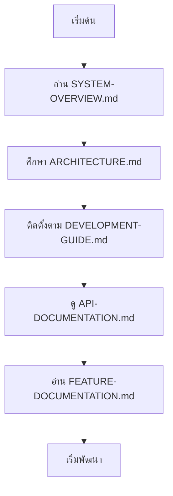
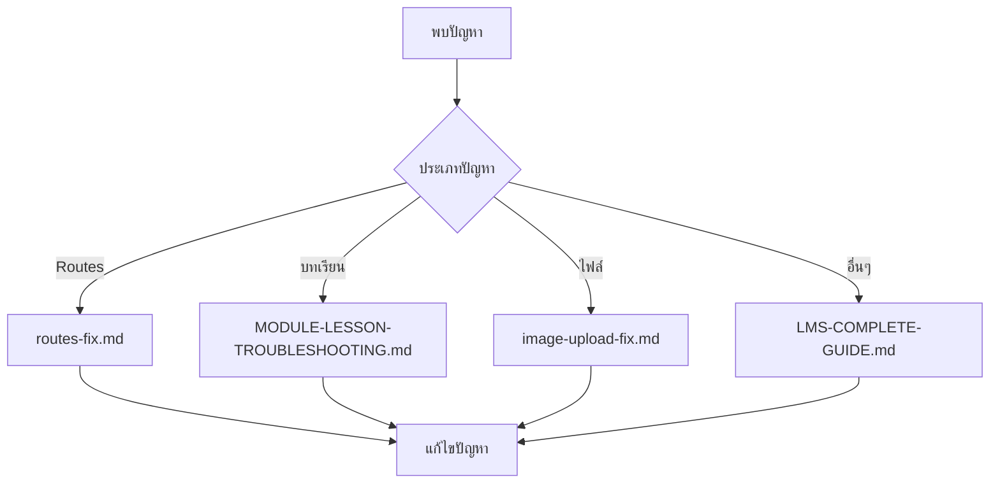

# 📚 CT Learning Documentation Index

## 🎯 บทนำ

ยินดีต้อนรับสู่ศูนย์กลางเอกสารของระบบ CT Learning! เอกสารนี้คือแหล่งข้อมูลที่ครบถ้วนสำหรับนักพัฒนา ผู้ดูแลระบบ และผู้ใช้งานทั่วไป ครอบคลุมตั้งแต่การติดตั้ง พัฒนา ไปจนถึงการใช้งานและการแก้ไขปัญหา

---

## 📋 สารบัญหมวดหมู่

### 🌟 เอกสารหลัก (Must Read)
| เอกสาร | คำอธิบาย | สำหรับ | ความสำคัญ |
|---------|---------|---------|---------|
| [📖 SYSTEM-OVERVIEW.md](SYSTEM-OVERVIEW.md) | ภาพรวมระบบสำหรับนักพัฒนา | นักพัฒนา | ⭐⭐⭐⭐⭐ |
| [🏗️ ARCHITECTURE.md](ARCHITECTURE.md) | สถาปัตยกรรมระบบอย่างละเอียด | นักพัฒนา | ⭐⭐⭐⭐⭐ |
| [📚 LMS-COMPLETE-GUIDE.md](LMS-COMPLETE-GUIDE.md) | คู่มือระบบครบถ้วน | ผู้ใช้งาน | ⭐⭐⭐⭐⭐ |
| [🚀 DEVELOPMENT-GUIDE.md](DEVELOPMENT-GUIDE.md) | คู่มือพัฒนาและติดตั้ง | นักพัฒนา | ⭐⭐⭐⭐⭐ |

### 🛠️ การพัฒนาและติดตั้ง
| เอกสาร | คำอธิบาย | ระดับ |
|---------|---------|-------|
| [📦 API-DOCUMENTATION.md](API-DOCUMENTATION.md) | API Documentation ครบถ้วน | ขั้นสูง |
| [🎯 FEATURE-DOCUMENTATION.md](FEATURE-DOCUMENTATION.md) | รายละเอียดฟีเจอร์ทั้งหมด | ขั้นสูง |
| [📋 ROUTES-REFERENCE.md](ROUTES-REFERENCE.md) | รายการ Routes ทั้งหมด | ขั้นกลาง |
| [⚡ QUICK-REFERENCE.md](QUICK-REFERENCE.md) | คู่มืออ้างอิงด่วน | ขั้นกลาง |

### 🔧 การแก้ไขปัญหา
| เอกสาร | คำอธิบาย | ประเภทปัญหา |
|---------|---------|-------------|
| [🔧 routes-fix.md](routes-fix.md) | การแก้ไขปัญหา Routes | Routes |
| [📝 MODULE-LESSON-TROUBLESHOOTING.md](MODULE-LESSON-TROUBLESHOOTING.md) | ปัญหาระบบบทเรียน | บทเรียน |
| [🖼️ image-upload-fix.md](image-upload-fix.md) | ปัญหาการอัปโหลดรูปภาพ | ไฟล์ |

### 📖 เอกสารประกอบ
| เอกสาร | คำอธิบาย | สถานะ |
|---------|---------|--------|
| [📄 README.md](README.md) | คู่มือการใช้งานระบบ | ✅ ปัจจุบัน |
| [🧪 TESTING.md](TESTING.md) | คู่มือการทดสอบ | 🔄 อัพเดท |
| [📦 INSTALLATION.md](INSTALLATION.md) | คู่มือการติดตั้ง | 🔄 อัพเดท |

---

## 🎯 แนวทางการใช้เอกสาร

### 👨‍💻 สำหรับนักพัฒนาใหม่


**ขั้นตอนที่แนะนำ:**
1. **เริ่มต้น**: [SYSTEM-OVERVIEW.md](SYSTEM-OVERVIEW.md) - ทำความเข้าใจภาพรวมระบบ
2. **ศึกษาโครงสร้าง**: [ARCHITECTURE.md](ARCHITECTURE.md) - เข้าใจสถาปัตยกรรม
3. **ติดตั้ง**: [DEVELOPMENT-GUIDE.md](DEVELOPMENT-GUIDE.md) - ติดตั้งสภาพแวดล้อม
4. **API**: [API-DOCUMENTATION.md](API-DOCUMENTATION.md) - ศึกษา API endpoints
5. **ฟีเจอร์**: [FEATURE-DOCUMENTATION.md](FEATURE-DOCUMENTATION.md) - ทำความเข้าใจฟีเจอร์ต่างๆ

### 🔧 สำหรับการแก้ไขปัญหา


**ค้นหาเอกสารตามปัญหา:**
- **Routes ไม่ทำงาน**: [routes-fix.md](routes-fix.md)
- **บทเรียน/โมดูล**: [MODULE-LESSON-TROUBLESHOOTING.md](MODULE-LESSON-TROUBLESHOOTING.md)
- **การอัปโหลดไฟล์**: [image-upload-fix.md](image-upload-fix.md)
- **ปัญหาทั่วไป**: [LMS-COMPLETE-GUIDE.md](LMS-COMPLETE-GUIDE.md)

### 📚 สำหรับการอ้างอิงด่วน
- **คำสั่งที่ใช้บ่อย**: [QUICK-REFERENCE.md](QUICK-REFERENCE.md)
- **รายการ Routes**: [ROUTES-REFERENCE.md](ROUTES-REFERENCE.md)
- **API Endpoints**: [API-DOCUMENTATION.md](API-DOCUMENTATION.md)

---

## 🏗️ โครงสร้างเอกสาร

### การจัดหมวดหมู่
```
context/docs/
├── 📚 INDEX.md                    # หน้าแรก (นี่)
├── 🌟 เอกสารหลัก/
│   ├── SYSTEM-OVERVIEW.md
│   ├── ARCHITECTURE.md
│   ├── DEVELOPMENT-GUIDE.md
│   ├── API-DOCUMENTATION.md
│   ├── FEATURE-DOCUMENTATION.md
│   └── LMS-COMPLETE-GUIDE.md
├── 🛠️ การพัฒนา/
│   ├── ROUTES-REFERENCE.md
│   ├── QUICK-REFERENCE.md
│   ├── TESTING.md
│   └── INSTALLATION.md
└── 🔧 การแก้ไขปัญหา/
    ├── routes-fix.md
    ├── MODULE-LESSON-TROUBLESHOOTING.md
    └── image-upload-fix.md
```

### มาตรฐานการเขียนเอกสาร
- **หัวข้อ**: ใช้ Emoji และภาษาที่เข้าใจง่าย
- **โครงสร้าง**: สารบัญ คำอธิบาย ตัวอย่างโค้ด
- **ภาษา**: ผสมผสมภาษาไทยและอังกฤษ (สำหรับเทคนิค)
- **การอัพเดท**: ระบุวันที่และเวอร์ชันที่หัวข้อ

---

## 📊 สถิติเอกสาร

### 📈 ความครบถ้วน
| หมวดหมู่ | จำนวนเอกสาร | สถานะ |
|-------------|----------------|--------|
| 📚 เอกสารหลัก | 5 | ✅ สมบูรณ์ |
| 🛠️ การพัฒนา | 4 | ✅ สมบูรณ์ |
| 🔧 การแก้ไขปัญหา | 3 | ✅ สมบูรณ์ |
| **รวม** | **12** | **✅ สมบูรณ์** |

### 🎯 ความครอบคลุม
- **✅ พัฒนา**: ติดตั้ง, API, Architecture, Testing
- **✅ ใช้งาน**: คู่มือ, ฟีเจอร์, คำแนะนำ
- **✅ แก้ไขปัญหา**: Routes, บทเรียน, ไฟล์
- **✅ อ้างอิง**: Quick reference, Routes list

---

## 🚀 การเริ่มต้นอย่างรวดเร็ว

### 1️⃣ สำหรับนักพัฒนาที่ต้องการเริ่มทันที
```bash
# 1. Clone repository
git clone https://github.com/pchan132/Project-CT-Learning.git
cd ct-learning

# 2. อ่านเอกสารหลัก
# - SYSTEM-OVERVIEW.md: ภาพรวมระบบ
# - DEVELOPMENT-GUIDE.md: การติดตั้งและพัฒนา
# - API-DOCUMENTATION.md: API endpoints

# 3. ติดตั้งตามคู่มือ
composer install
npm install
cp .env.example .env
php artisan key:generate
php artisan migrate
php artisan storage:link

# 4. เริ่มพัฒนา
php artisan serve
```

### 2️⃣ สำหรับผู้ใช้ที่ต้องการใช้งาน
1. อ่าน [LMS-COMPLETE-GUIDE.md](LMS-COMPLETE-GUIDE.md) สำหรับการใช้งานทั้งหมด
2. ดู [README.md](README.md) สำหรับคำแนะนำเบื้องต้น

### 3️⃣ สำหรับการแก้ไขปัญหาเฉพาะจุด
- **Routes**: [routes-fix.md](routes-fix.md)
- **บทเรียน**: [MODULE-LESSON-TROUBLESHOOTING.md](MODULE-LESSON-TROUBLESHOOTING.md)
- **ไฟล์**: [image-upload-fix.md](image-upload-fix.md)

---

## 🔄 การอัพเดทเอกสาร

### วงจรการอัพเดท


### นโยบายการอัพเดท
- **เมื่อมีการเปลี่ยนแปลงโค้ด**: อัพเดทเอกสารที่เกี่ยวข้อง
- **เมื่อเพิ่มฟีเจอร์**: อัพเดท FEATURE-DOCUMENTATION.md และ API-DOCUMENTATION.md
- **เมื่อมีปัญหา**: สร้าง/อัพเดทเอกสารแก้ไขปัญหา
- **รายเดือน**: ทบทวนและอัพเดทเอกสารทั้งหมด

### การมีส่วนร่วม
- **รายงานปัญหา**: สร้าง Issue ใน GitHub
- **แนะนำการปรับปรุง**: สร้าง Pull Request
- **ถามคำถาม**: ใช้ GitHub Discussions

---

## 📞 ข้อมูลการติดต่อและสนับสนุน

### 👥 ทีมพัฒนา
| บทบาท | ชื่อ | ช่องทางติดต่อ |
|---------|------|---------------|
| **Project Lead** | [Pchan132](https://github.com/pchan132) | GitHub |
| **Development Team** | CT Learning Team | dev@ct.ac.th |

### 🔗 ลิงก์สำคัญ
| ประเภท | ลิงก์ | คำอธิบาย |
|---------|-------|-------------|
| **Repository** | https://github.com/pchan132/Project-CT-Learning | Source Code |
| **Documentation** | https://github.com/pchan132/Project-CT-Learning/tree/main/context/docs | เอกสาร |
| **Issues** | https://github.com/pchan132/Project-CT-Learning/issues | รายงานปัญหา |
| **Discussions** | https://github.com/pchan132/Project-CT-Learning/discussions | ถาม-ตอบ |

### 📧 ช่องทางการติดต่อ
- **Email ทั่วไป**: dev@ct.ac.th
- **รายงานปัญหา**: GitHub Issues
- **คำถามทั่วไป**: GitHub Discussions
- **ฉุกเฉิน**: support@ct.ac.th

### 🏫 หน่วยงาน
- **แผนกเทคโนโลยีคอมพิวเตอร์**: วิทยาลัยเทคโนโลยีชลบุรี
- **ที่อยู่**: 199 ถนนมหาวิทย์ ตำบลเวียง อำเภอเมือง จังหวัดชลบุรี 20000
- **โทรศัพท์**: 02-xxx-xxxx

---

## 📜 ประวัติการอัพเดทเอกสาร

### v2.0 - 29 พฤศจิกายน 2025
- ✅ เพิ่มเอกสารหลักใหม่: SYSTEM-OVERVIEW.md, DEVELOPMENT-GUIDE.md, API-DOCUMENTATION.md, FEATURE-DOCUMENTATION.md
- ✅ อัพเดท ARCHITECTURE.md ให้ละเอียดขึ้น
- ✅ ปรับปรุง INDEX.md ให้เป็นศูนย์กลาง
- ✅ เพิ่ม Mermaid diagrams สำหรับการแสดงผล
- ✅ จัดระเบียบเอกสารตามหมวดหมู่

### v1.0 - 28 พฤศจิกายน 2025
- ✅ สร้างเอกสารพื้นฐาน: README.md, LMS-COMPLETE-GUIDE.md, ARCHITECTURE.md
- ✅ เพิ่มเอกสารแก้ไขปัญหา: routes-fix.md, MODULE-LESSON-TROUBLESHOOTING.md, image-upload-fix.md
- ✅ สร้างเอกสารอ้างอิง: ROUTES-REFERENCE.md, QUICK-REFERENCE.md
- ✅ จัดทำ INDEX.md ฉบับแรก

---

## 🎯 แผนพัฒนาเอกสาร

### 🚀 แผนอนาคต (ระยะสั้น)
- [ ] เพิ่ม Video Tutorials
- [ ] สร้าง Interactive Documentation
- [ ] เพิ่ม Code Examples ให้มากขึ้น
- [ ] แปลเอกสารเป็นภาษาอังกฤษ

### 🌟 แผนปี 2025 (ระยะยาว)
- [ ] สร้าง Documentation Website
- [ ] เพิ่ม API Testing Tools
- [ ] สร้าง Troubleshooting Wizard
- [ ] เพิ่ม Community Contributions

### 📊 การวัดผล
- **การใช้งาน**: ติดตามการเข้าชมเอกสาร
- **ความพึงพอใจ**: สำรวจความคิดเห็นผู้ใช้
- **ประสิทธิภาพ**: วัดเวลาการแก้ไขปัญหา
- **การมีส่วนร่วม**: ติดตาม contributions จาก community

---

## 🏆 การขอบคุณ

### 🙏 ผู้มีส่วนร่วม
- **Pchan132** - Project Lead & Main Developer
- **CT Learning Team** - Development & Testing
- **แผนกเทคโนโลยีคอมพิวเตอร์** - การสนับสนุนและทรัพยากร

### 📜 ใบอนุญาต
เอกสารนี้อยู่ภายในใบอนุญาต MIT License สามารถนำไปใช้และดัดแปลงได้ตามเงื่อนไข

---

**เอกสารปรับปรุงล่าสุด**: 29 พฤศจิกายน 2025  
**เวอร์ชันเอกสาร**: v2.0  
**ผู้ดูแลเอกสาร**: CT Learning Documentation Team  
**สถานะ**: ✅ Complete & Enhanced  

---

<p align="center">
  <strong>📚 CT Learning - Documentation Center</strong><br>
  <em>Your complete guide to understanding, developing, and mastering CT Learning</em>
</p>

<p align="center">
  <a href="#-บทนำ">📖 เริ่มต้น</a> •
  <a href="#-เอกสารหลก-must-read">🌟 หลัก</a> •
  <a href="#️-การพฒนาและตดตง">🛠️ พัฒนา</a> •
  <a href="#-การแกไขปญหา">🔧 แก้ไข</a> •
  <a href="#-ขอมลการตดตอ">📞 ติดต่อ</a>
</p>