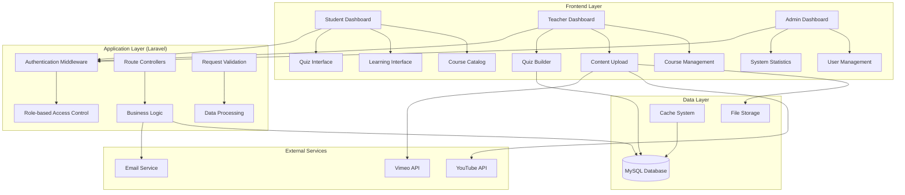
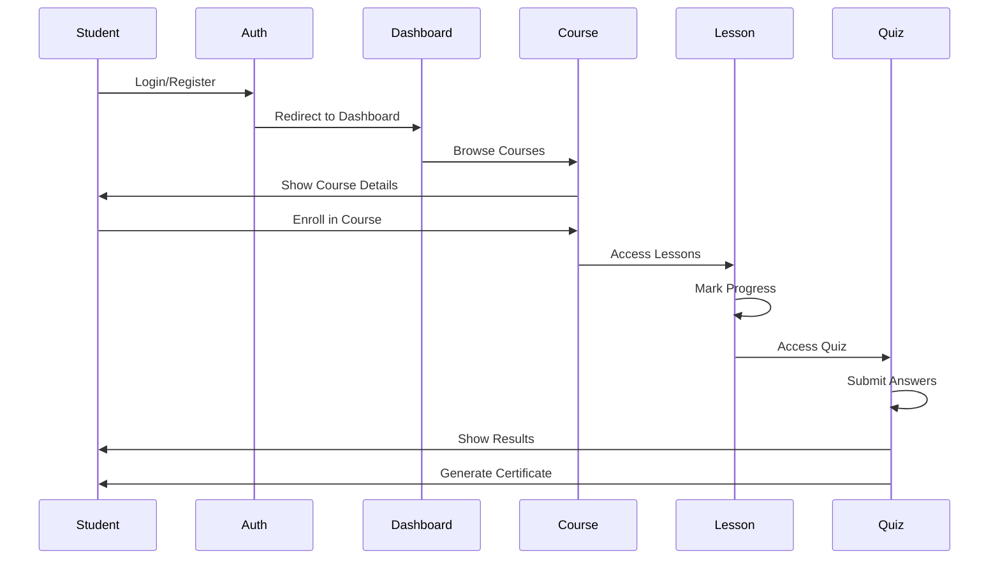
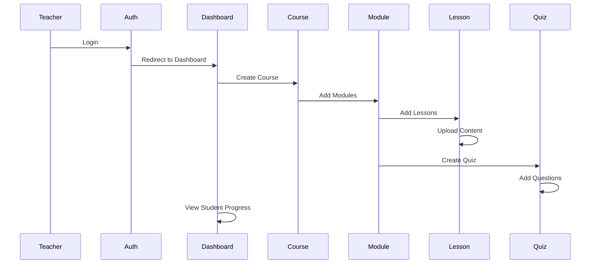
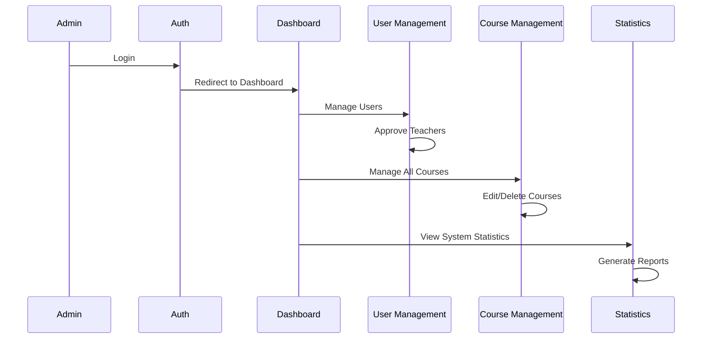

# System Architecture - LMS Platform

## ภาพรวมสถาปัตยกรรมระบบ



## โครงสร้างไฟล์และโฟลเดอร์

```
app/
├── Http/
│   ├── Controllers/
│   │   ├── Auth/
│   │   │   ├── AuthenticatedSessionController.php
│   │   │   ├── RegisteredUserController.php
│   │   │   └── EmailVerificationNotificationController.php
│   │   ├── Student/
│   │   │   ├── DashboardController.php
│   │   │   ├── CourseController.php
│   │   │   ├── LessonController.php
│   │   │   └── QuizController.php
│   │   ├── Teacher/
│   │   │   ├── DashboardController.php
│   │   │   ├── CourseManagementController.php
│   │   │   ├── ContentController.php
│   │   │   └── QuizBuilderController.php
│   │   ├── Admin/
│   │   │   ├── DashboardController.php
│   │   │   ├── UserController.php
│   │   │   └── StatisticsController.php
│   │   └── API/
│   │       ├── CourseAPIController.php
│   │       ├── QuizAPIController.php
│   │       └── ProgressAPIController.php
│   ├── Middleware/
│   │   ├── RoleMiddleware.php
│   │   ├── TeacherMiddleware.php
│   │   └── AdminMiddleware.php
│   └── Requests/
│       ├── CourseRequest.php
│       ├── QuizRequest.php
│       └── UserRequest.php
├── Models/
│   ├── User.php
│   ├── Course.php
│   ├── Module.php
│   ├── Lesson.php
│   ├── Quiz.php
│   ├── Question.php
│   ├── Choice.php
│   ├── CourseUser.php
│   ├── LessonProgress.php
│   ├── QuizAttempt.php
│   └── QuizAnswer.php
└── Services/
    ├── CertificateService.php
    ├── FileUploadService.php
    ├── QuizGradingService.php
    └── ProgressTrackingService.php

resources/
├── views/
│   ├── layouts/
│   │   ├── app.blade.php
│   │   ├── guest.blade.php
│   │   └── components/
│   ├── auth/
│   ├── student/
│   │   ├── dashboard.blade.php
│   │   ├── courses/
│   │   ├── lessons/
│   │   └── quizzes/
│   ├── teacher/
│   │   ├── dashboard.blade.php
│   │   ├── courses/
│   │   ├── modules/
│   │   └── quizzes/
│   ├── admin/
│   │   ├── dashboard.blade.php
│   │   ├── users/
│   │   └── statistics/
│   └── components/
│       ├── navbar.blade.php
│       ├── sidebar.blade.php
│       └── cards/
├── css/
│   └── app.css
└── js/
    ├── app.js
    ├── quiz.js
    ├── progress.js
    └── file-upload.js

routes/
├── web.php
├── api.php
└── auth.php
```

## การทำงานของระบบ (System Flow)

### 1. Student Flow


### 2. Teacher Flow


### 3. Admin Flow


## เทคโนโลยีและ Tools

### Backend Stack
- **Framework**: Laravel 10.x
- **Database**: MySQL 8.0
- **Authentication**: Laravel Breeze
- **File Management**: Spatie Media Library
- **PDF Generation**: DomPDF
- **Cache**: Redis (optional)

### Frontend Stack
- **Template Engine**: Blade
- **CSS Framework**: Tailwind CSS
- **JavaScript**: Vanilla JS + Alpine.js
- **File Upload**: Dropzone.js
- **Video Player**: Video.js

### Development Tools
- **Package Manager**: Composer
- **Asset Building**: Vite
- **Version Control**: Git
- **Testing**: PHPUnit
- **Code Style**: Laravel Pint

## Security Considerations

### Authentication & Authorization
- Role-based Access Control (RBAC)
- Email Verification
- Password Hashing
- Session Management
- API Token Authentication (Sanctum)

### Data Protection
- Input Validation
- SQL Injection Prevention
- XSS Protection
- CSRF Protection
- File Upload Security

### Performance Optimization
- Database Indexing
- Query Optimization
- Caching Strategy
- Image Optimization
- Lazy Loading

## Scalability Considerations

### Database Design
- Normalized Tables
- Proper Indexing
- Foreign Key Constraints
- Soft Deletes

### Application Design
- Service Layer Pattern
- Repository Pattern (optional)
- Event-Driven Architecture
- Queue System for Heavy Tasks

### Deployment Strategy
- Environment Configuration
- Asset Optimization
- Database Migration
- Backup Strategy
- Monitoring Setup